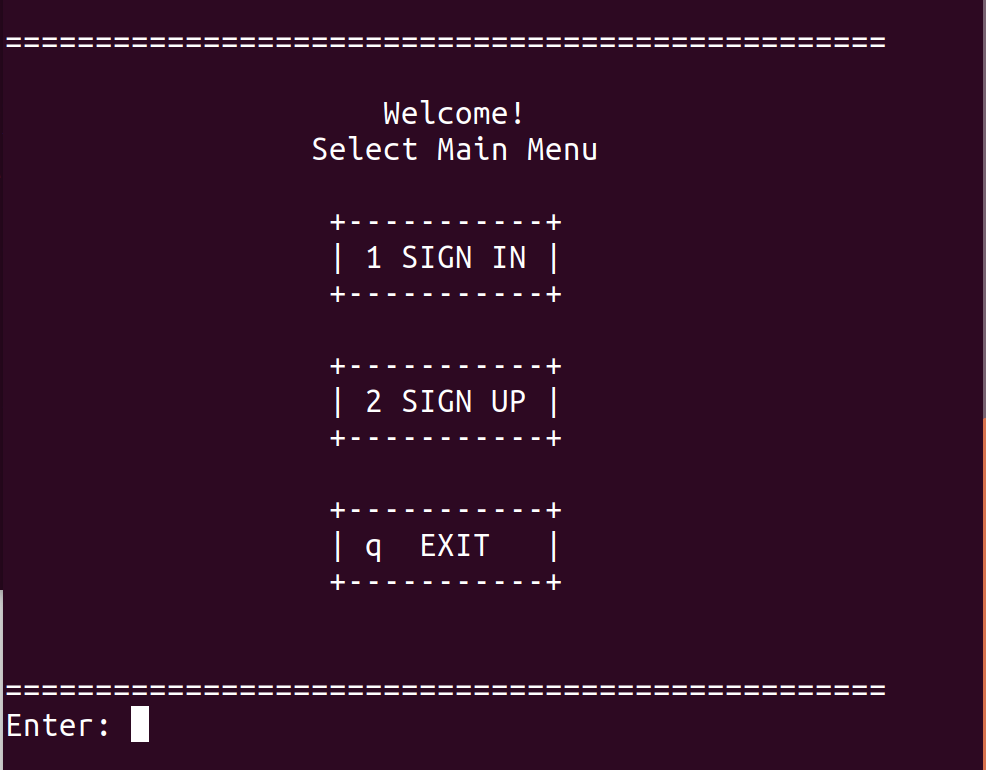
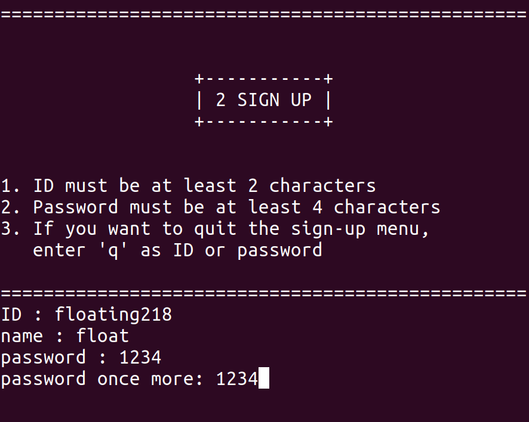
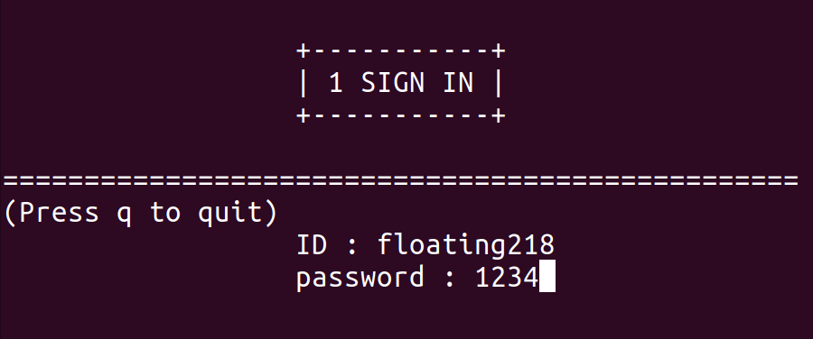
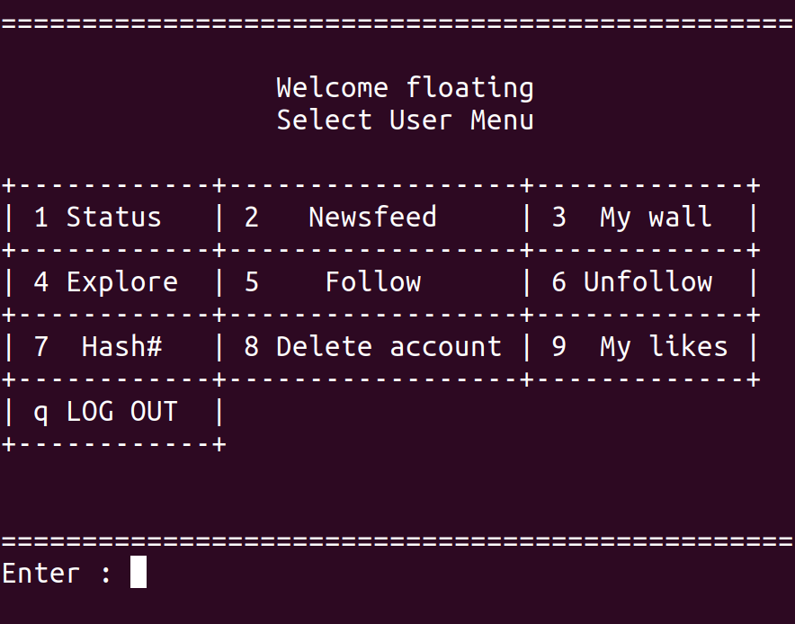

## 설치하기(우분투 18 기준)

### MongoDB 설치,실행

```bash
$ sudo apt-key adv --keyserver hkp://keyserver.ubuntu.com:80 --recv 9DA31620334BD75D9DCB49F368818C72E52529D4
$ echo "deb [ arch=amd64 ] https://repo.mongodb.org/apt/ubuntu bionic/mongodb-org/4.0 multiverse" | sudo tee /etc/apt/sources.list.d/mongodb-org-4.0.list
$ sudo apt-get update
$ sudo apt-get install -y mongodb-org
$ sudo service mongod start
```

### PyMongo 설치

```bash
$ pip3 install pymongo
```

## 실행하기

```bash
$ python3 main.py
```

## 메인 메뉴
<center>

</center>

## 2→ 회원가입(Sign Up)
<center>

</center>

## 1 → 로그인(Sign In)
<center>

</center>

## 로그인 후 유저메뉴
<center>

</center>

## 주요 기능 
- 3 My wall 내 담벼락 가서 내 글 쓰기할 수 있음
- 2 Newsfeed 뉴스피드에 들어가면 내가 팔로한 사람들의 포스팅을 모두 볼 수 있음
- 4 Explore 기능을 통해 다른 사람의 담벼락을 둘러볼 수 있음
- 5 6 Folling 기능을 통해 내 팔로우 목록을 관리할 수 있음
- 7 Hash 기능을 통해 원하는 검색어나 해시태그를 포함하는 포스팅을 볼 수 있음
- 9 My likes 기능을 통해 내가 좋아요를 누른 포스팅을 모아서 볼 수 있음